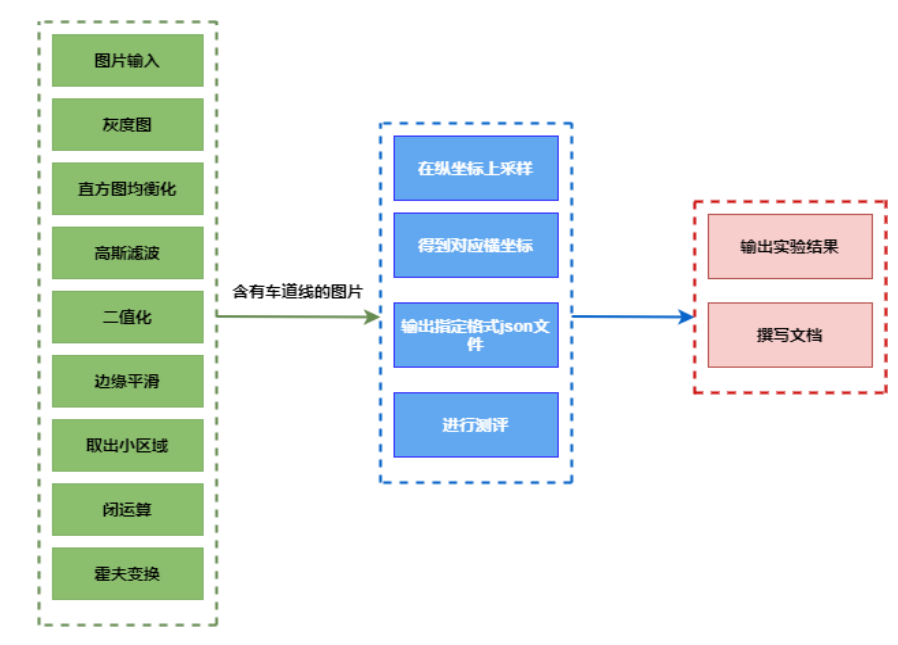
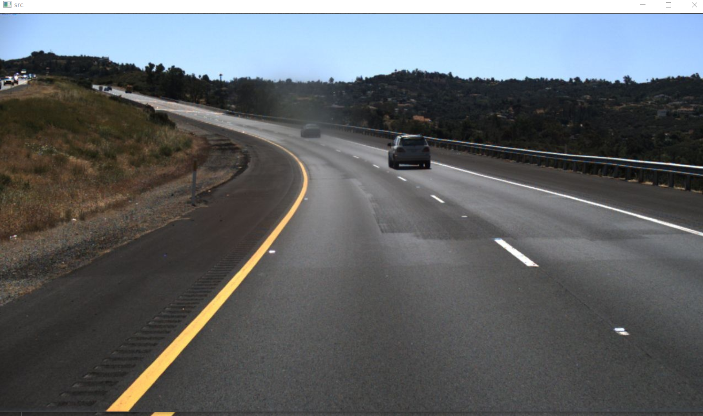
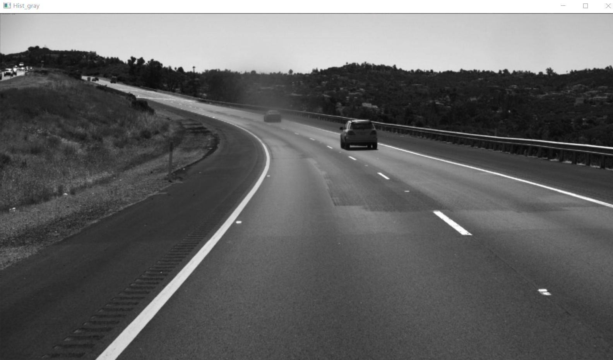
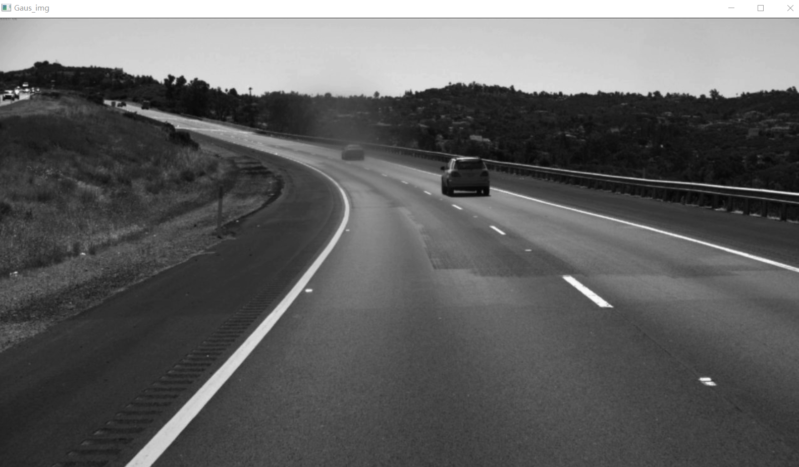
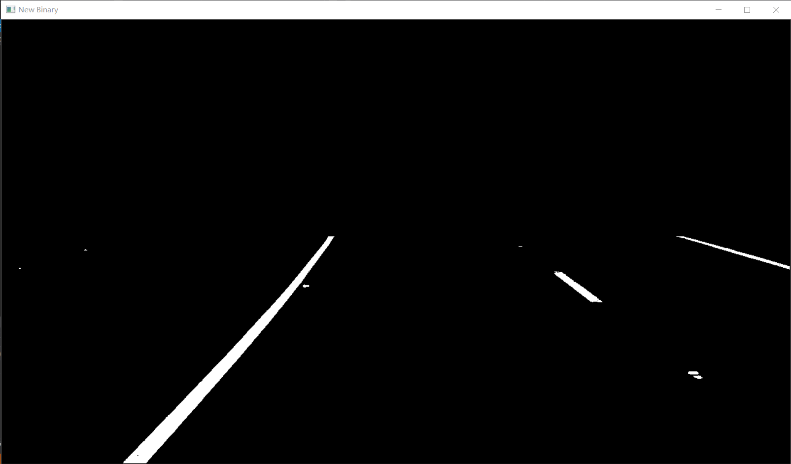
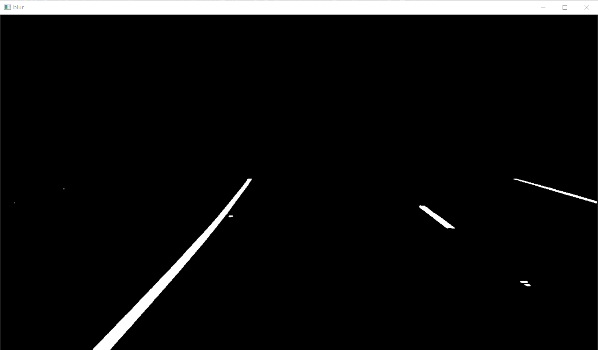
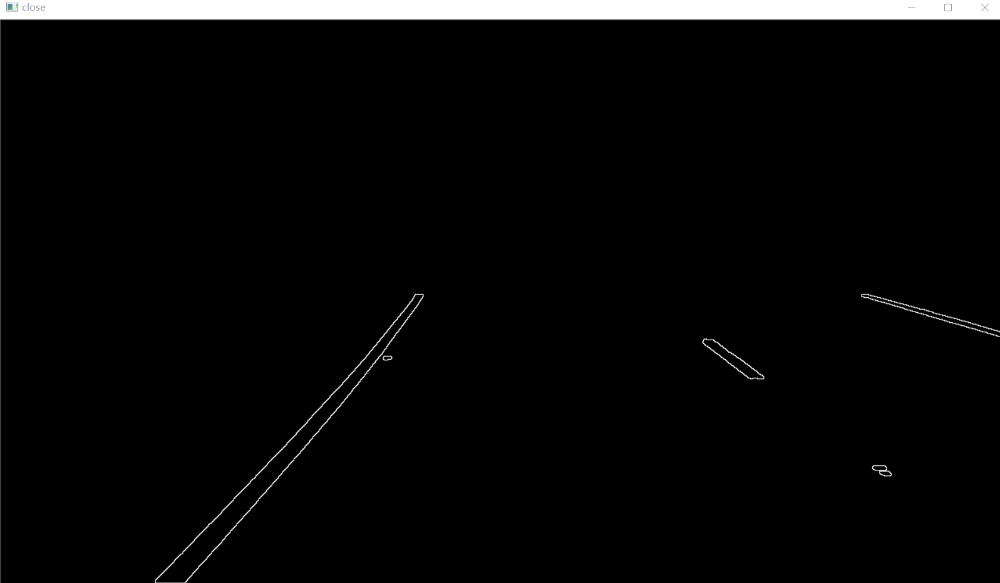
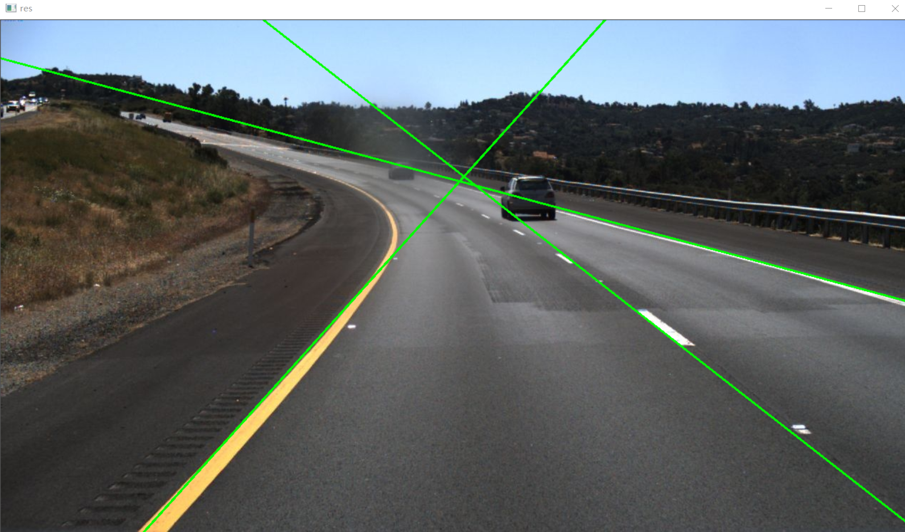
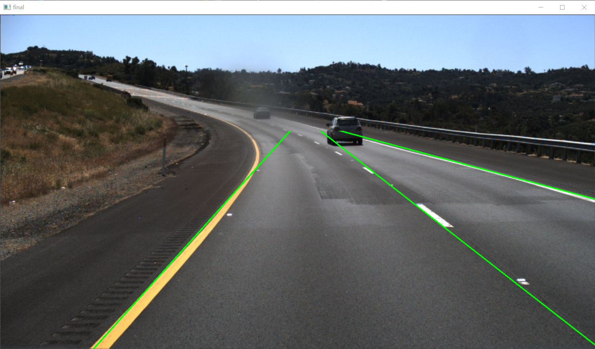
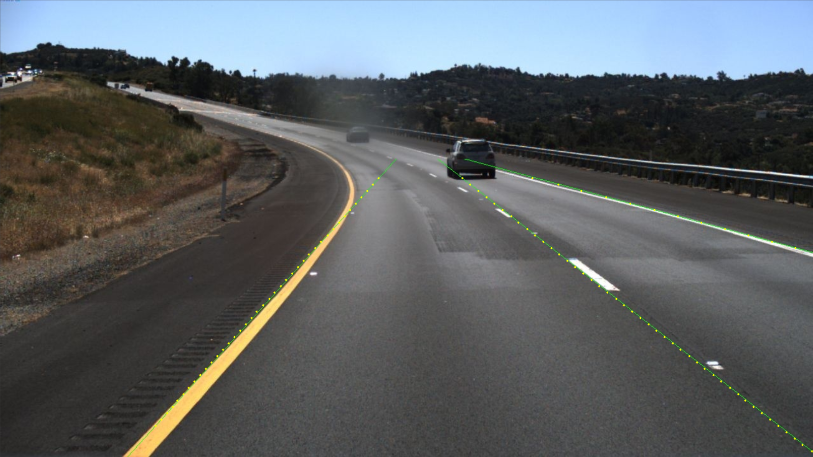

# Traditional_Lane_Detection
BIT-CS Digital Image Process Great Assignment : Lane Detection based on traditional method.

### 项目简介
1. 运用传统图像处理方法进行车道线检测
2. 除了图像的输入和输出外，不能调用任何库
3. 不用神经网络，深度学习的方法，仅仅使用传统方法 

### 实验环境
* **VisualStudio2019**
* **OpenCV**
* **Json**
* **python3.6**
* **numpy**

### 处理流程
 
#### 原图

#### 灰度图
myRGB2GRAY()函数具体原理为将 image 图像的 RGB 三个通道拆分，为每个像素点的 RGB 值进行相应的运算，得到灰度值。运算公式为 gray = 0.1140 * blue + 0.5870 * green + 0.2989 * red
 
#### 直方图均衡化 
直方图均衡化的实现分为四个步骤：统计每个灰度下的像素个数、统计灰度频率、统计累计密度、重新计算灰度之后的值。
 
#### 高斯滤波 
对直方图均衡化之后的灰度图调用 myGaussian 函数进行高斯模糊，设置卷积核 kernel 的大小 ksize = 3，sigma = 1.5。

#### 二值化
高斯模糊之后，调用 myGaus2Binary()函数对图像进行二值化处理。二值化处理分为以下几步：①提取 ROI，将纵坐标 350 及以下的部分设置为黑色，因为该部分车道线较少，这样设置能过够减少计算量。②将灰度值大于 150 小于 255部分设置为白色。

#### 边缘平滑
得到二值图之后，调用 MedianFlitering()函数进行边缘平滑，边缘平滑
的原理为中值滤波。对每个像素点，取它以及周围的八邻域的中值取代它，从而
实现边缘平滑。

#### 去除小区域
调用 RemoveSmallRegion()函数去除一些小区域，对于某些情况，例如车道
上存在车辆，可能会对二值化之后的图像造车高干扰，形成面积较小的白块，使
用这个函数的目的是让出去小区域的干扰，让提取的线更“纯净”，因此去除小
区域是十分有必要的。
具体代码如下所示：参数 CheckMode: 0 代表去除黑区域，1 代表去除白区域;
NeihborMode：0 代表 4 邻域，1 代表 8 邻域;
 

#### 闭运算提取边界
闭运算是对图像先进行膨胀再进行腐蚀，在本次车道线检测的闭运算中，膨
胀时卷积核大小为 2*2，腐蚀过程卷积核大小为 1*1。这样闭运算之后就能达到
边缘提取的效果。 

#### 霍夫变换
利用霍夫变换提取图像中的直线, 具体代码如下所示。霍夫变换的原理在此
不多赘述，重点想讲述一下直线筛选的过程。
由于霍夫变换之后得到的直线数量很多，为了得到符合条件的直线，我们有
必要对直线进行一定的筛选。在 draw_lane()函数种对直线进行比较精确地筛选，
首先根据车道线的淘汰画面中较为平行的直线，接着设定 rho 和 angle 的阈值，
淘汰重复的直线，使得每条车道仅有一条直线保留。

#### 提取ROI


### 结果测评
在纵坐标方向280-720每隔10个像素点采样。
  
采用 https://github.com/TuSimple/tusimple-benchmark  中的数据集格式测评。
### 项目文件结构 
``` 
 |-source    
 | |-LaneDetection.cpp //车道线检测源代码   
 |   
 |-result   
 | |-clips //保存结果图片   
 | |-…   
 |   
 |-utils //一些工具  
 | |-extract_info.py //从 groundtruth 中筛选出待测 json  
 | |-generate_json.py //从 result 文件夹的照片生成 json 用于测评  
 | |-visual.py //用于可视化 result 的结果  
 | |-lane.py //用于测评  
 | |-pic_test.json //测试集的 groundtruth  
 | |-pic_list.txt //待测图片路径  
 |  
 |-README.md
```


 